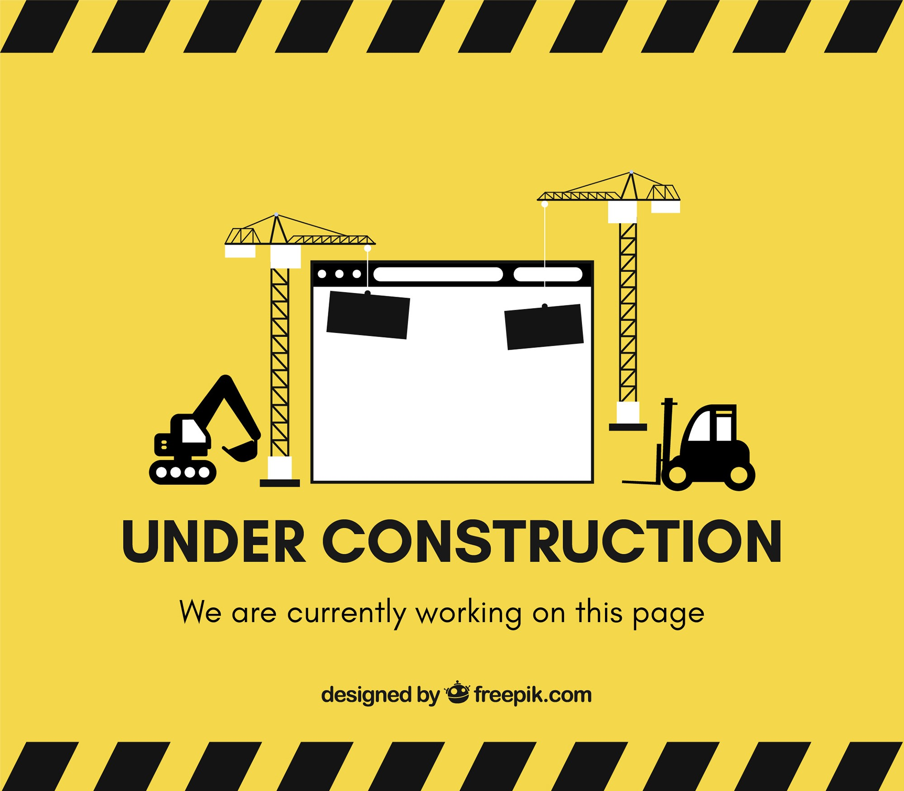

# Portafolio de datos

## Bienvenidos al repositorio de análisis de datos realizado por:
- Edgar Alvarado Flores

*Por el momento el repositorio se encuentra en proceso de subir y dar formato a los distintos proyectos*

En él se mostraran distintos proyectos de análisis de datos realizados durante los distintos cursos y certificaciones que he tomado en la materia, en ellos se aplicaran los distintos procesos y herramientas del anális de datos.
Se mostrarán las 6 fases del análisis de datos:
- Preguntar
- Preparar
- Procesar
- Analizar
- Compartir
- Actuar

En estos proyectos se utilizaran distintas tecnologías como:
- SQL
- R
- Tableau
- Hojas de calculo
- Python

